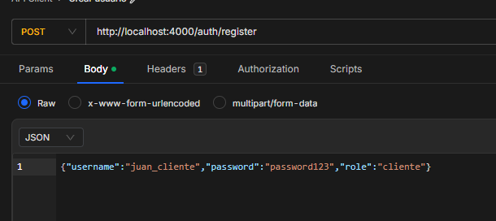

# API Ticketing

## Descripción

Ésta es una API RESTful para gestionar solicitudes de soporte, implementada con Node.js, Express y SQLite. Permite la autenticación de usuarios, creación de solicitudes y gestión de roles (cliente, soporte y administrador).

## 🚀 Tecnologías

- **Backend**: Node.js + Express
- **Base de datos**: SQLite


## 📁 Estructura del Proyecto

```
api-ticketing/
├── src/
│   ├── app.js           # Configuración del servidor y middlewares
│   ├── db.js            # Conexión a la base de datos y creación de tablas
│   ├── routes/
│   │   ├── auth.js      # Rutas de autenticación (login, registro)
│   │   ├── users.js     # Rutas de gestión de usuarios
│   │   └── requests.js  # Rutas de gestión de solicitudes
├── .env                 # Variables de entorno (credenciales, JWT_SECRET)
├── database.sqlite      # Base de datos SQLite
├── package.json         # Dependencias y scripts del proyecto
└── README.md            # Documentación del proyecto
```

## 🔧 Instalación

1. Clona el repositorio:

```bash
git clone https://github.com/lccardenasma96/api-ticketing.git
cd api-ticketing
```

2. Instala las dependencias:

```bash
npm install
```

3. Configura las variables de entorno:

Crea un archivo `.env` en la raíz del proyecto con el siguiente contenido:

```env
DB_PATH=database.sqlite
JWT_SECRET=tu_secreto_jwt
```

4. Inicia el servidor:

```bash
npm start
```

El servidor estará corriendo en `http://localhost:4000`.

## 🧪 Endpoints

### 📌 Autenticación

- `POST /auth/login`: Inicia sesión y obtiene un token JWT.
- `POST /auth/register`: Registra un nuevo usuario.

### 👥 Usuarios

- `GET /users`: Obtiene una lista de usuarios.
- `GET /users/:id`: Obtiene un usuario por ID.


### 🎟️ Solicitudes

- `GET /requests`: Obtiene una lista de solicitudes.
- `GET /requests/:id`: Obtiene una solicitud por ID.
- `POST /requests`: Crea una nueva solicitud.
- `PUT /requests/:id`: Actualiza una solicitud por ID.

## 🔐 Roles y Permisos

La aplicación soporta tres roles de usuario:

- **Cliente**: Puede crear y ver sus propias solicitudes.
- **Soporte**: Puede ver todas las solicitudes y actualizarlas.
- **Administrador**: Puede gestionar usuarios y solicitudes.

Los roles se gestionan a través de middleware de autorización en las rutas correspondientes.

## 🛠️ Desarrollo

Para la creación de usuarios se puede realizar con el curl:




## 📄 Documentación Adicional

Para más detalles sobre cómo interactuar con la API, consulta el archivo `curls.md`, que contiene ejemplos de solicitudes cURL para probar cada uno de los endpoints.

